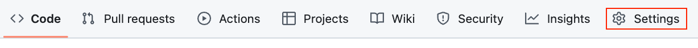
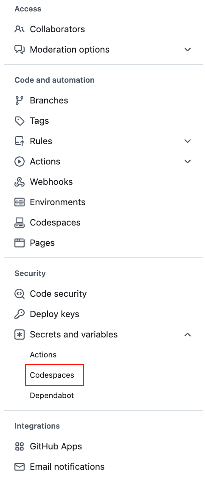
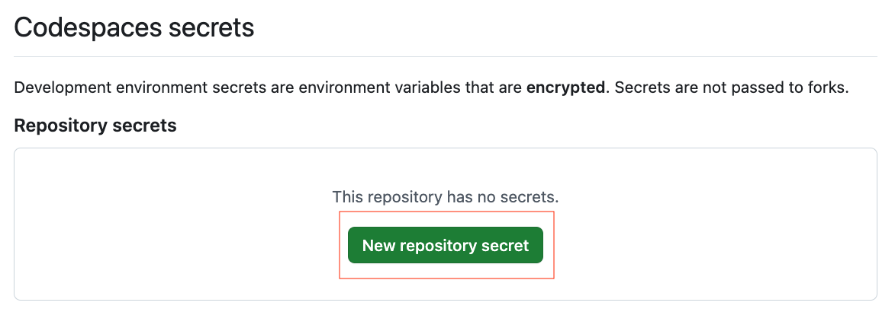
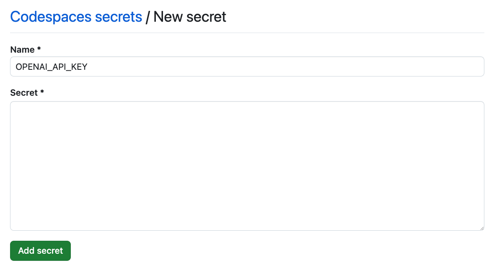
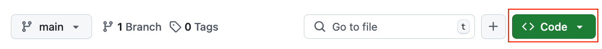
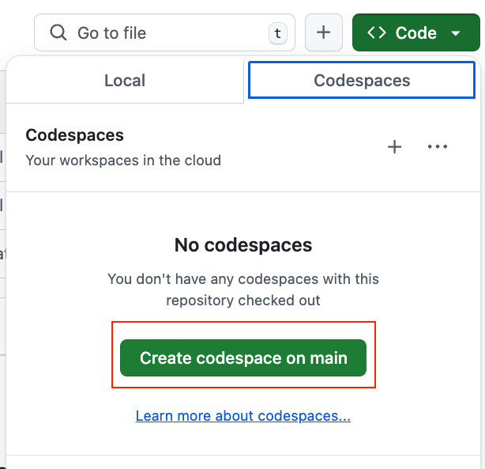

# Running in GitHub Codespaces  

Instead of installing **Ballot Initiative** on your local machine, you can run it in **GitHub Codespaces**, which provides a containerized development environment. Using Codespaces offers several advantages:  

1. **Quick Setup** – Get started instantly without manually configuring your development environment.  
2. **Cross-Platform Compatibility** – Work seamlessly from any operating system using a browser-based, cloud-hosted environment.  
3. **Portability & Flexibility** – Access your project from any device with a browser, eliminating dependency conflicts on your local machine.  

## Instructions:

### Adding the OPENAI API key:

1. Navigate to Your Repository Settings
* In your forked repo of the Ballot Initiative Repo, click on the **Settings** tab.

2. Access Codespaces Secrets
* In the left sidebar, scroll down to **"Secrets and Variables"** and click on **"Codespaces"**.

* Click **"New repository secret"**.  

3. Add a **Secret**  
* In the **"Name"** field, enter `OPENAI_API_KEY`.  
* In the **"Value"** field, paste your API key.
* Click **"Add secret"** to save it.  

### Launch Github Codespaces:

1. Back on the repository's page, locate the green **"Code"** button near the top right corner of the page.

2. Click on the **"Create codespace on main"** button.

The container will build and automatically launc the Ballot Initiative Application.