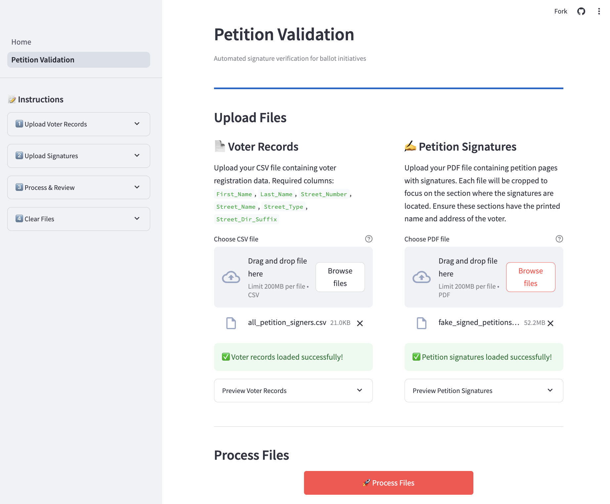
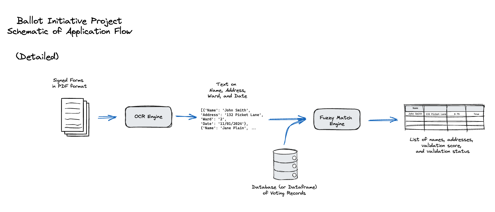

# Ballot Initiative

An open-source tool to automate signature validation for ballot initiatives using OCR and fuzzy matching.

> **Note:** Tool is tailored to DC petitions ([example](sample_data/fake_signed_petitions.pdf)), and would need to be modified to fit other formats.



## Table of Contents

1. [Introduction](#introduction)
   - [Core Approach](#core-approach)
2. [Getting Started](#getting-started)
   - [Prerequisites](#prerequisites)
   - [Installation](#installation)
   - [Running the Application](#running-the-application)
3. [Project Documentation](#project-documentation)
   - [Learning Materials](#learning-materials)
   - [Additional Resources](#additional-resources)
4. [License](#license)

## Introduction

In 2024, voters sought to get "Ranked Choice Voting on the DC Ballot." To do so volunteers and staff had to walk throughout the neighborhoods of DC asking people if they were willing to sign their name in support of the measure
[("They want to change how D.C. votes — one signature at a time", WaPo 2024)](https://www.washingtonpost.com/dc-md-va/2024/05/22/dc-voting-ballot-initiative-signatures/)

> **After a person signs on the dotted line, each signature must then be linked by name and address to an actual D.C. voter.** Though the Board of Elections will verify signatures when it receives petitions, Mintwood Strategies verifies them first.
>
> Kris Furnish, the initiative’s field director, typed names from the signature sheets into a database that linked the signature to a voter and checked for duplicates. Only when the signature was validated in this internal system would the person who collected it be paid for it, she said.
>
> **It was slow, painstaking work. Furnish struggled with a person’s middle name that was illegible.** She decided it was “Alexa.” That middle name popped up in the database linked to an address that the voter had provided.

The process of checking signatures for ballot initiatives is time consuming and boring. All that time could be better spent collecting more signatures or doing higher level political organizing around the issue that the ballot-initiative represents.

The goal of the Ballot Initiative project is to reduce the manual labor involved in the signature-checking process by automating the simplest aspects of that process. This repo collects some preliminary versions of code that allow users to upload PDF files of ballot initatives signatures and to validate whether these signatures are connected to names in a voter records file.

### Core Approach



1. **Extraction:** Forms in PDF format are processed through an OCR engine (using [gpt-4o-mini](https://platform.openai.com/docs/models/gpt-4o-mini)) to crop text sections and extract data.

2. **Identification:** The engine identifies and extracts key information (tailored to DC Ballot Initiatives) related to validating signatures:

   - Names
   - Addresses
   - Wards
   - Dates

3. **Matching:** Extracted data names and addresses are passed through a Fuzzy Match engine (using [Levenshtein distance](https://en.wikipedia.org/wiki/Levenshtein_distance)) that compares against a CSV of voter records. Harmonic mean of the two scores is used as the net validation score.

4. **Output:** System outputs a table of results containing:
   - Name (OCR and Record Match)
   - Address (OCR and Record Match)
   - Validation score
   - Validation status

## Getting Started

### Prerequisites

- Python 3.8 or higher
- OpenAI API key
- PDF files of ballot initiative signatures
  - Use fake data in [`sample_data/fake_signed_petitions.pdf`](sample_data/fake_signed_petitions.pdf) folder to test.
- Voter records file (access is limited - see note below)
  - Use fake data in [`sample_data/fake_voter_records.csv`](sample_data/fake_voter_records.csv) folder to test.

### Installation

1. Clone the repository:

```bash
git clone https://github.com/your-org/ballot-initiative.git
cd ballot-initiative
```

2. Create and activate a virtual environment:

```bash
# Create virtual environment
python -m venv venv

# Activate virtual environment
# On Windows:
venv\Scripts\activate
# On macOS/Linux:
source venv/bin/activate
```

3. Install dependencies:

```bash
pip install -r requirements.txt
```

4. Set up your environment:
   - Create a `.env` file in the project root folder.
   - Replicate the format shown in the `.env.example` file.
   - [Get an OpenAI API key](https://www.howtogeek.com/885918/how-to-get-an-openai-api-key/) if you don't have one
   - Add your OpenAI API key to the `.env` file:
     ```
     OPENAI_API_KEY=<YOUR_API_KEY>
     ```

### Running the Application

1. Start the Streamlit app:

```bash
streamlit run app/Home.py
```

2. Upload your files:
   - PDF of signed petitions
   - Voter records file
   - Sample data is available in the `sample_data` folder for testing

## Project Documentation

### Learning Materials

- [Onboarding Notebook](notebooks/2025-01-20-onboarding_notebook.ipynb) [(Colab)](https://githubtocolab.com/Civic-Tech-Ballot-Inititiave/Ballot-Initiative/blob/main/notebooks/onboarding_notebook_colab.ipynb): Comprehensive guide covering project goals and background, OCR implementation examples, and fuzzy matching implementation examples

### Additional Resources

- [Streamlit Documentation](https://docs.streamlit.io/get-started) - Framework used for the application interface
- [DC Initiative and Referendum Process](https://code.dccouncil.gov/us/dc/council/code/sections/1-1001.16) - Official process documentation
- [Washington Post Article](https://www.washingtonpost.com/dc-md-va/2024/05/22/dc-voting-ballot-initiative-signatures/) - Context and background

## License

This project is open-sourced under the MIT License - see the [LICENSE](LICENSE.md) file for details.
