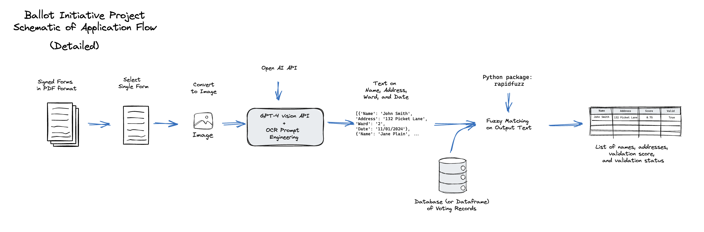

# Ballot-Initiative



## Table of Contents

1. [Introduction](#introduction)
2. [Development Setup](#dev-setup)
3. [Learning About Project](#learning-about-project)
4. [Run Application Locally](#run-application-locally)
5. [App Usage Guide](#app-usage-guide)
6. [Extra Resources](#extra-resources)

## Introduction

In 2024, voters sought to get "Ranked Choice Voting on the DC Ballot." To do so volunteers and staff had to walk throughout the neighborhoods of DC asking people if they were willing to sign their name in support of the measure
[("They want to change how D.C. votes — one signature at a time", WaPo 2024)](https://www.washingtonpost.com/dc-md-va/2024/05/22/dc-voting-ballot-initiative-signatures/)

> **After a person signs on the dotted line, each signature must then be linked by name and address to an actual D.C. voter.** Though the Board of Elections will verify signatures when it receives petitions, Mintwood Strategies verifies them first.
>
> Kris Furnish, the initiative’s field director, typed names from the signature sheets into a database that linked the signature to a voter and checked for duplicates. Only when the signature was validated in this internal system would the person who collected it be paid for it, she said.
>
> **It was slow, painstaking work. Furnish struggled with a person’s middle name that was illegible.** She decided it was “Alexa.” That middle name popped up in the database linked to an address that the voter had provided.

The process of checking signatures for ballot initiatives is time consuming and boring. All that time could be better spent collecting more signatures or doing higher level political organizing around the issue that the ballot-initiative represents.

The goal of the Ballot Initiative project is to reduce the manual labor involved in the signature-checking process by automating the simplest aspects of that process. This repo collects some preliminary versions of code that allow users to upload PDF files of ballot initatives signatures and to validate whether these signatures are connected to names in a voter records file.

_(NOTE: We welcome code contributions to the repo, but some of the contributions will likely require access to a voter records file. Access to this file is currently limited)_

<!--
## Current Processing Pipeline

The current approach is to use OCR to extract names and addreses from documents and then use [fuzzy matching](https://en.wikipedia.org/wiki/Approximate_string_matching) algorithms to validate the extracted names with a reference record. This process is depicted below


In this process, we start with a collection of scanned PDFs of signed ballot initiatives. Processing these PDFs a page at a time, we convert them into an image, and then process the image through an OCR function (in this case `gpt-4-vision`). The output of the processing is a dictionary of voter names and addresses. We then compare this dictionary with records we find in a voter database. Getting a close match between the OCR output names and a row in the voter records database, means the signature has been validated (specifically, we provide a score for degree of matching). -->

## Development Setup

To run any of the notebooks and the app itself. You need to ensure you have the requisite local files, API keys, and libaries.

1. After cloning the repository, from the terminal run

```
pip install -r requirements.txt
```

to install the required libraries

2. Create a `.env` file in the `app` folder with a defined `OPENAI_API_KEY`.

```
#.env file contents

OPENAI_API_KEY = <YOUR API KEY>
```

_NOTE: You currently have to use your own API key for the project, but getting one is quite easy. Check out this guide [("How to get an OpenAI API Key for ChatGPT")](https://www.maisieai.com/help/how-to-get-an-openai-api-key-for-chatgpt) to learn how to get your own API key._

3. The voter records file does not exist in this repository and must be requested from the repository owner. Once the file is requested, save it as `raw_feb_23_city_wide.csv` file to the `data` folder.

## Learning About Project

If you're new to the project, you should first work through the onboarding notebook.

- [Onboarding Notebook](notebooks/onboarding_notebook.ipynb): Goes through the goals of the projects, provides examples on the OCR, and the fuzzy match validation. At the end outlines some ways to contribute to the existing work.
  - [Colab Notebook](https://githubtocolab.com/Civic-Tech-Ballot-Inititiave/Ballot-Initiative/blob/main/notebooks/onboarding_notebook_colab.ipynb)

The current process for going through submitting a ballot initiative is as follows:

- A Ballot Initiative Manager (BIM) comes up with an idea for a Ballot Initiative
  - They must collect a certain number of valid signatures by a particular date to get their initiative on the ballot
  - Signatures are considered valid if the name and address match a registered voter
- A BIM creates a campaign and recruits several Signature Collectors (SC)
- SCs go out and collect signatures from citizens. Each citizen must handwrite their:
  - name
  - address
  - ward (optional)
  - signature
- BIMs receive many pages of signatures from SCs and pay SCs per validated signature
- BIMs may benefit from the following metrics:
  - Number of verified signatures collected
  - Number of verified signatures per ward
  - Nuber of signatures remaining
    - Assuming buffer percentage over target amount
    - Could determine a buffer percentage based on percent invalid signatures collected
  - Rate of collecting signatures
  - Expected date to reach goal, assuming current rate
- After completing all signatures required, the BIM submits the pages of collected signatures to the government

## Run Application Locally

Once you have installed the needed libraries, saved your API key to your `.env` file, and saved the `raw_feb_23_city_wide.csv` file to the `data` folder. You can now run the app locally. From the library installations, you should have `streamlit` available on the command line. To start the app locally

1. From the terminal run

```
streamlit run app/app.py
```

2. In order to test the OCR and Validation, pass in a PDF of ballot inititatives.

## App Usage Guide

_This section is currently in development. Usage instructions will be added._

## Extra Resources

Here are some additional resources to help you better contribute to the repository.

- [Streamlit: Getting Started](https://docs.streamlit.io/get-started) Currently the "application" is run in streamlit, a framework for doing quick proof-of-concepts entirely in Python. If you want to learn more about streamlit to contribute to the current version of the application.
- [DC Initiative and Referendum Process](https://code.dccouncil.gov/us/dc/council/code/sections/1-1001.16): Describes the process by which issues are placed on the ballot and how the BOE verifies signatures.
- ["They want to change how D.C. votes — one signature at a time"](https://www.washingtonpost.com/dc-md-va/2024/05/22/dc-voting-ballot-initiative-signatures/) Washington Post Article describing the slow process of collecting and verifying signatures. Provides context for why OCR is valuable.
